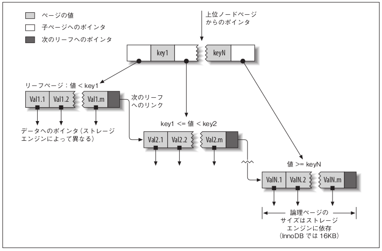
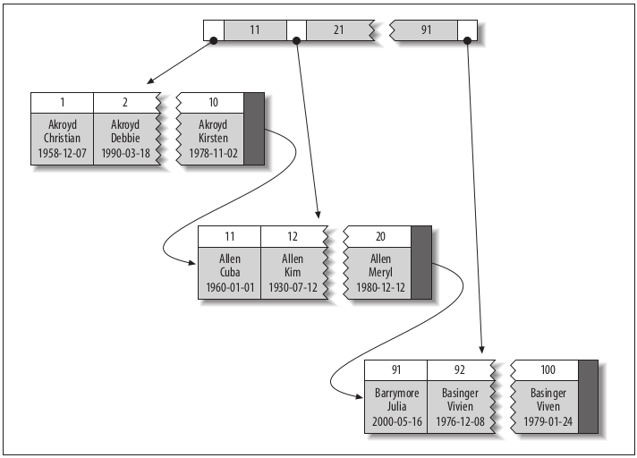

# 5章 インデックスによるパフォーマンスの向上

インデックスは、ストレージエンジンが行を素早く検索するために使用するデータ構造のこと。
インデックスはパフォーマンスを向上させるのに欠かせない存在となる。
データセットが大きいほどインデックスの効果は大きくなる。


- 5.1 インデックスの基礎
- 5.2 インデックスの利点
- 5.3 ハイパフォーマンスを可能にするインデックス戦略
- 5.4 インデックスのケーススタディ
- 5.5 インデックスとテーブルの管理
- 5.6 まとめ


# 5.1インデックスの基礎
インデックスは本の索引に置き換えるとわかりやすい。
特定の項目が本のどこに乗っているのかを確認するために索引を調べれば、その項目登場するベージ番号がわかる。

MySQL のストレージエンジンでも、インデックスが同じような方法で使用されている。
下記のクエリを例にした場合、で考える。
```
mysql> SELECT first_name FROM sakila.actor WHERE actor_id = 5;
```
`actor_id`列にインデックスを振られている場合、Mysqlでは`actor_id`5の箇所をインデックスを見て検索して行の取得をする。

```
actor_id
1 ・・・ 5行目
2 ・・・ 8行目
3 ・・・ 3行目
4 ・・・ 10行目
5 ・・・ 40行目
```

インデックスには一つだけではなく複数の指定ができる。(例：IDとNameにインデックスを付与)

## 5.1.1 インデックスの種類

インデックスは様々な種類があり、目的に合わせて設計されている。
インデックスはサーバー層ではなくストレージエンジン層で実装されているため、データベースエンジンごとに動作がことなります。

MySQLがサポートしているインデックスの種類について説明します。
※B木インデックスが基本的に使用されるため他のインデックスは簡単な説明にします。

### B木インデックス

インデックスと言われたら基本的にはB木インデックスのことを指しています。

MySQLのストレージエンジンのほとんどは、この種類のインデックスをサポートしている。Archive エンジンは例外であり、インデックスをまったくサポートをしています。

B木の一般的な考え方はすべての値が順番に格納され、各リーグページがルートから等距離にある。
下記の図が表したのもになる。



上記の図には記載がないがB木インデックスはルートノードからから始まる。
ルートノードの各スロットには子ノードへのポインタが格納され、ストレージエンジンはポインタをたどる。
ストレージエンジンは正しいポインタを特定するために子ノードの値の上限と下限を定義をしており、ストレージエンジンはその上限、下限を見てポインタを判断していって目的のデータを取得する。
リーフページは、他のページへのポインタではなくインデックス付けされた実際のデータへのポインタを保持をしている。

B木構造の利点はデータを検出するのにテーブル全体をスキャンする必要がたいため、データアクセスを高速化すること。

***B木インデックスを使用できるクエリの種類***

B 木インデックスは下記のクエリの場合使用ができる。
クエリの例では「last_name, first_name」の順でインデックスをつけている場合を想定。
- すべての値の一致
    - `SELECT * FROM user WHERE last_name = 'kobayashi' AND first_name = 'taro'`
- 左端のプレフィックスの一致
    - このインデックスは、`kobayashi` という姓を持つ人物を全員検索するのに役立つ。
    - `SELECT * FROM user WHERE last_name = 'kobayashi'`
- 列のプレフィックスの一致
    - 列の値の最初の部分でマッチングを行うことができる。
    - `SELECT * FROM user WHERE last_name LIKE 'k%'`
- 値の範囲の一致
    - このインデックスは、`a` と `d` の間の姓を持つ人物を検索するのに役立つ。
    - `SELECT * FROM user WHERE last_name BETWEEN 'a' AND 'd'`
- ある部分での完全な一致と別の部分での範囲の一致
    - 姓が `kobayashi` 、名が `a`の文字で始まる人物を検索するのに役立つ。
    - `SELECT * FROM user WHERE last_name = 'kobayashi' AND first_name = 'a'`
- インデックス専用クエリ
    - カバリングインデックスのみを使用したクエリ。（詳細は5.3.6で説明）簡単に言うとindex以外取得項目含め使用していないクエリ
    - `SELECT last_name FROM user WHERE last_name = 'kobayashi'` 

B木インデックスは値が順番に並んで保持をしているため、検索とソートの両方に使用ができる。

***B木インデックスの制限**
B木インデックスには制限がある。
クエリの例では「last_name, first_name」の順でインデックスをつけている場合を想定。

- 条件を指定するときにインデックスを付けた順でカラムの指定をしないと効果がない。
    - `SELECT * FROM user WHERE first_name = 'taro' AND last_name = 'kobayashi'`
- インデックスで列をスキップすることはできない。
    - `SELECT * FROM user WHERE first_name = 'taro' AND birthday = '1994-04-23'`
- ストレージエンジンは、最初の範囲条件の右側に位置する列を使ってアクセスを最適化できない。
    - `SELECT * FROM user WHERE last_name = 'kobayashi' AND first_name LIKE 't%' AND birthday = '1994-04-23'`

これらの制限はすべて列の順序付けに関連している。
そのため、パフォーマンスを最適化する際には、クエリを満たすために順序を気にしながらインデックスの作成が必要。

### ハッシュインデックス

ハッシュインデックスは、ハッシュテーブルに基づくインデックスであり、インデックスのすべ
ての列を使用する完全なルックアップでのみ役立つ 。


### 空間（R 木）インデックス

MyISAM で使用ができるインデックス。

###　全文インデックス

テキスト（FULLTEXT）に含まれているキーワードを検索する、特殊なインデックス。

# 5.2 インデックスの利点

インデックスの利点は下記３点ある。

- サーバーが調べなければならないデータの量が少なくなる
- サーバー上でのソートや一時テーブルが不要になる
- ランダム I/O がシーケンシャル I/O に変わる

- データの取得の高速化
    - ノードの上限下限を見て移動をするため目的の位置に素早く移動ができる
- ソートの高速化
    - インデックスではすでにソートされているため、ソートが不要
- グルーピングの高速化
    - 関連する値が近くまとめて格納をしているためグルーピングが高速

データがすでにソートされているため、B 木インデックスは関連する値を近くにまとめて格納する。さらに、B 木インデックスは実際には値のコピーを格納するため、クエリによってはインデックスだけで対応できる。

# 5.3 ハイパフォーマンスを可能にするインデックス戦略

ここでは、インデックスを使用してハイパフォーマンスを可能にする方法を紹介します。

## 5.3.1 列の分離

クエリにおいてインデックス付けされた列が分離されていない場合、インデックスを使用できない。

列の「分離」とは、その列が式の一部であってはならないことまたは、関数に含まれていてはならないことを意味します。


下記例では`actor_id`にインデックスが付与されています。
***式の一部になっている例***

``` sql 
mysql> SELECT actor_id FROM sakila.actor WHERE actor_id + 1 = 5;
```

***関数に含まれている例***
``` sql
mysql> SELECT ... WHERE TO_DAYS(CURRENT_DATE) - TO_DAYS(date_col) <= 10;
```

## 5.3.2 プレフィックスインデックスとインデックスの選択性

場合によっては非常に長い文字列にインデックスを付けなければならないことがあります。
長い文字列にインデックスを付与をしてもサイズが大きく、速度も遅くななってしまいます。

そういった場合にプレフィックスインデックスを使用して、最初の数文字をインデックスとすることでサイズの減少ができ速度の向上ができます。

プレフィックスインデックスでは選択性に気をつける必要があります。
例えば最初の1文字をインデックスにした場合、同じ文字から始まるカラムが多いほどインデックスでほしいデータの文字を絞ったあとに目的のデータと合致しているものがどれかを選択しなければ行けないです。そういった状態を選択性が低いということになります。
選択性が高ければインデックスで除外する行の数が多くなる。


例として、カラム`city`にインデックスを付与する場合を考える。
※正規化は考慮していないです。

```
-- テーブル作成
CREATE TABLE sakila.city_demo(city VARCHAR(50) NOT NULL);
-- データ登録
INSERT INTO sakila.city_demo(city) SELECT city FROM sakila.city;
-- 次のステートメントを 5 回繰り返す
INSERT INTO sakila.city_demo(city) SELECT city FROM sakila.city_demo;
-- 分布をランダム化する（効率性よりも利便性を重視）
UPDATE sakila.city_demo　SET city = (SELECT city FROM sakila.city ORDER BY RAND() LIMIT 1);

mysql> SELECT COUNT(*) AS cnt, city
    -> FROM sakila.city_demo GROUP BY city ORDER BY cnt DESC LIMIT 10;

+-----+----------------+
| cnt | city           |
+-----+----------------+
| 65 | London          |
| 49 | Hiroshima       |
| 48 | Teboksary       |
| 48 | Pak Kret        |
| 48 | Yaound          |
| 47 | Tel Aviv-Jaffa  |
| 47 | Shimoga         |
| 45 | Cabuyao         |
| 45 | Callao          |
| 45 | Bislig          |
+-----+----------------+
```

最初の３文字にプレフィックスをする場合を考えて見る。
```
mysql> SELECT COUNT(*) AS cnt, LEFT(city, 3) AS pref
-> FROM sakila.city_demo GROUP BY pref ORDER BY cnt DESC LIMIT 10;

+-----+------+
| cnt | pref |
+-----+------+
| 483 | San  |
| 195 | Cha  |
| 177 | Tan  |
| 167 | Sou  |
| 163 | al-  |
| 163 | Sal  |
| 146 | Shi  |
| 136 | Hal  |
| 130 | Val  |
| 129 | Bat  |
+-----+------+

```
３文字の場合、各プレフィックスの出現回数のほうがはるかに多くなっている。


プレフィックスの選択性が完全な長さの列とほぼ同じになるまで、プレフィックスを徐々に長くしていく。
今回の場合は7が適切の値です。

```
mysql> SELECT COUNT(*) AS cnt, LEFT(city, 7) AS pref
-> FROM sakila.city_demo GROUP BY pref ORDER BY cnt DESC LIMIT 10;

+-----+---------+
| cnt | pref    |
+-----+---------+
| 70 | Santiag  |
| 68 | San Fel  |
| 65 | London   |
| 61 | Valle d  |
| 49 | Hiroshi  |
| 48 | Teboksa  |
| 48 | Pak Kre  |
| 48 | Yaound   |
| 47 | Tel Avi  |
| 47 | Shimoga  |
+-----+---------+

-- インデックス作成
alter table city_demo add index name_index(city(7));

```

プレフィックスインデックスでは常にインデックスのサイズと選択性を考慮する必要があります。

# 5.3.3 複数列のインデックス

MySQL 5.0 以降のバージョンでインデックスマージと呼ばれる戦略に従い、うまくインデックス付けされていないテーブルに少しだけ対処できます。

目的の行を見つけ出すために、１つのテーブル内の複数のインデックスをある程度使用ができる。

下記のクエリの場合、5.0以前はテーブルスキャンを行っていた。
``` sql
mysql> SELECT film_id, actor_id FROM sakila.film_actor WHERE actor_id = 1 OR film_id = 1;
```

テーブルスキャンをしないように`UNION`を使用していた。

```sql
mysql> SELECT film_id, actor_id FROM sakila.film_actor WHERE actor_id = 1 UNION ALL SELECT film_id, actor_id FROM sakila.film_actor WHERE film_id = 1 AND actor_id <> 1;
```

上記に対し5.0以降では両方のインデックスを使用ができ、同時にスキャンをして結果をマージできるようになった。
Extra 列を調べてみるとわかるように、2 つのインデックススキャンの和集合を使用している。

```
mysql> EXPLAIN SELECT film_id, actor_id FROM sakila.film_actor WHERE actor_id = 1 OR film_id = 1\G
*************************** 1. row ***************************
id: 1
select_type: SIMPLE
table: film_actor
type: index_merge
possible_keys: PRIMARY,idx_fk_film_id
key: PRIMARY,idx_fk_film_id
key_len: 2,2
ref: NULL
rows: 29
Extra: Using union(PRIMARY,idx_fk_film_id); Using where

```

複数列のインデックスは、OR 条件の和集合、AND 条件の積集合、2 つの組み合わせの積集合の和集合という 3 種類で使用ができる。

上記の方法でうまくはいくが、下記３つの理由により大抵はテーブルがうまくインデックス付けされていないことのほうが多い。

- 通常は AND 条件でインデックスの積集合を取得する場合、通常は、複数のインデックスの組み合わせではなく、関連する列がすべて含まれた単一のインデックスが必要であることを意味する
- 通常は OR 条件でンデックスの和集合を取得する場合、アルゴリズムのバッファリング、ソート、マージ操作で CPU やメモリリソースが大量に消費されることがある。そのためOR条件はなるべく避けたほうが良い
- UNION自体がコストが高いため、通常のテーブルスキャンよりも実際には遅い可能性がある。

# 5.3.4 適切な列の順序を選択する

複数列のインデックスで指定する順序はクエリによって決めます。

そのため、クエリに役立つ方法で行がソートされ、グループ化されるような順序を選択する方法について考える必要があります。

列の順序を選択するためには、まずはソートやグループ化をするカラム、次に条件式で使用されるカラムの中で最も選択的な列を先にすること。

# 5.3.5 クラスタ化インデックス
クラスタ化インデックスはインデックスではなく、データストレージへのアプローチとなる。

簡単に言うとデータは基本`PRIMARY KEY`の値を元に並び替えをして保持しています。

クラスタ化インデックスはB木インデックスと行をまとめて同じ構造に格納するしています。テーブルにクラスタ化インデックスが作成されている場合、そのテーブルの行は、実際にはインデックスのリーフページに格納される。

クラスタ化インデックスはテーブルにつき 1 つしか使用できない。

下記がクラスタ化インデックスでのレコードのレイアウトを示しています。


リーフページには完全な行が含まれており、ノードページにはインデックスがついた列だけが含まれる。
インデックスが付いた列には整数値が含まれる。
InnoDB はデータを主キーでクラスタ化する。つまり、図 5-3 の「インデックスが付いた列」は主キー列である。

### クラスタ化インデックスの利点
- 関連するデータを近くに配置できる。とえば、メールボックスを実装する際には、user_id でクラスタ化すると、ディスクから数ページを読み込むだけで、1 人のユーザーのメッセージをすべて取得できるようになる。
- ータアクセスが高速である。クラスタ化インデックスはインデックスとデータの両方を 1つの B 木に格納するため、通常はクラスタ化インデックスから行を取得するほうが高速。

# 5.3.6 カバリングインデックス

クエリを処理するために必要なデータをすべて含んでいる（カバーしている）インデックスは、カバリングインデックスと呼ばれている。

データの変わりにインデックスだけを読み取ることには次のような利点がります。
- 通常、インデックスエントリは行全体のサイズよりもはるかに小さいため、MySQL がインデックスだけを読み取る場合、アクセスするデータはずっと少なくなる。
- インデックスは（少なくともページ内では）インデックス値でソートされるため、I/O バウンドの範囲アクセスは、ランダムなディスク位置から各行を取得する場合と比べて、必要なI/O が少ない。

一般的には、行を参照するよりもクエリをインデックスで処理するほうがずっとコストがかからない。

インデックスによってカバーされるクエリ（インデックスカバークエリ）を実行すると、EXPLAIN
の Extra 列に "Using index" が表示される。

```
mysql> EXPLAIN SELECT store_id, film_id FROM sakila.inventory\G
*************************** 1. row ***************************
id: 1
select_type: SIMPLE
table: inventory
type: index
possible_keys: NULL
key: idx_store_id_film_id
key_len: 3
ref: NULL
rows: 4673
Extra: Using index
```

# 5.3.7 ソートにインデックススキャンを使用する

MySQL には、順序付きの結果を生成するための方法が 2 つある。
1 つはソートを使用する方法であり、もう 1 つはインデックスを順番にソートする方法。

MySQL は、行のソートと検索に同じインデックスを使用できる。できれば、両方のタスクに同時に役立つようなインデックスを設計するのが望ましい。

クエリが複数のテーブルを結合する場合は、ORDER BY 句のすべての列が 1 つ目のテーブルを参照するケースに限られる。

# 5.3.8 圧縮された（プレフィックス圧縮された）インデックス
※MyISAMへのインデックスになるため割愛

# 5.3.9 冗長インデックスと重複インデックス
MySQL では、同じ列で複数のインデックスを作成できる。
そのため重複してインデックスを作成してしまうことがある。

重複したインデックスはメモリを余分に消費してしまったり、登録や更新を遅らせる要因にもなりかねないためインデックス作成時にはどういうインデックスがあるのか確認が必要。

また、冗長インデックスを作成してしまうこともある。
例えば、既に`ID`でインデックスを作成している所に別のインデックスとして、（ID、Name）で複合インデックスを作成した場合に冗長となる。

理由としては（ID、Name)のインデックスはIDとしてもインデックスを利かすことができるがIDのインデックスが既に存在しているためIDのインデックスが重複しているため冗長となる。

避けるためには既にある既存のインデックスを拡張するのが望ましい。

ただし冗長インデックスはクエリによってはカラムの条件をつける順序を変更できない場合もあるため冗長になってしまう場合もある。（カバリングインデックスやVARCHAR列を追加等）

# 5.3.10 使用されないインデックス
重複インデックスと冗長インデックス以外に、サーバーがまったく使用しないインデックスがある場合は削除をすべき。

Mysql5.7から導入された`sys.schema_unused_indexes`を使用すれば使用していないインデックスを特定することができます。

```sql
select * from sys.Schema_unused_indexes;
```
本書に無い内容のため簡単な説明のみですが、このクエリを使用すればMysqlを起動してから一度も使用されていないindexを表示してくれます。

ただし途中から使用しなくなったものや月次のバッチで使用している場合は一回の実行で特定は難しいため一回実行してから一ヶ月後にもう一度実行をして実行回数が変わっていないものを削除するといったやり方が良さそうです。

# 5.3.11 インデックスとロック
インデックスを使ってクエリがロックする行の数を減らすこともできる。

InnoDBは、行にアクセスするときだけロックをする。そのため、インデックスを使用して予め検索する行を減らして置くことでロックする行を少なくできる。

次の２つの理由からパフォーマンスがよくなる。
1. 行ロックに伴うオーバーヘッドをなくすことができる。
2. 必要以上に行をロックするとロック競合しやすくなり、平行性が低下する。

# 5.4 インデックスとテーブルの管理
正しいデータ型でテーブルを作成し、インデックスを追加したらそれで終わりではない。
テーブルとインデックスを管理してそれらをうまく機能させるための措置を考える必要がる。
テーブルのメンテナンスの主な目的は、破損した部分の検出と修正、正確なインデックス統計の維持、断片化の削減の３つ。

## 5.4.1 テーブルの破損の検出と修復
テーブルで起こる最悪の事態は破損になります。
どのストレージエンジンでもハードウェアの故障やMySQLまたはOS内部のバグが原因でインデックスの破損に直面する可能性があります。

インデックスが破損すると、クエリが正しい結果を返さなくなり、重複する値がないにもかかわらずキーの重複エラーが発生し、ロックアップやクラッシュを引き起こすこともある。
そういった起こるはずがないエラーなどおかしな振る舞いに気がついた場合は`CHECK TABLE`を実行してテーブルが破損していないか確認をする。

`CHECK TABLE`はテーブルとインデックスのほとんどのエラーを補足する。
また、破損したテーブルには`CHECK TABLE`を使用すると修復が可能。

```sql
-- 破損したテーブルの確認
CHECK TABLE　テーブル名

-- テーブルの修復
REPAIR TABLE テーブル名
```
それでも修復できない場合は、バックアップからの復元が必要になる。

詳細はドキュメントを確認。
https://dev.mysql.com/doc/refman/8.0/ja/rebuilding-tables.html

## 5.4.2 インデックス統計を更新する

MySQL のクエリオプティマイザは、インデックスの使用方法を決定するためにインデックス値の分布状況をストレージエンジンに問い合わせる際、下記2 つの API 呼び出しを使用する。

> クエリオプティマイザとはストレージエンジンの機能、特定の操作にかかるコスト、テーブルデータの統計をストレージエンジンに問い合わせをして、クエリを効率よく処理できるのか実行計画を作成する機能。


records_in_range() : 入力として範囲の先頭と末尾を受け取り、その範囲に含まれているレコードの数を返す。
この呼び出しは、MyISAM などのストレージエンジンでは正確な数を返すが、InnoDB では概算にすぎない。

info() : インデックスの濃度（各キー値に対するレコードのおおよその数）を含め、さまざまな種類のデータを返すことができる。

もし統計データが生成されない、または無効な統計データである場合オプティマイザが誤った実行計画を作成する可能性がある。そのため`ANALYZE TABLE`を実行し、統計データの生成し直すことが必要。

innodbで統計データを生成し直す頻度は下記が有効。

1. テーブルが 10% を超える行に変更された場合に統計データを生成する。`innodb_stats_auto_recalc` 変数が有効になっている場合、自動で行うようになっています。(デフォルトは有効になっている)
2. `innodb_stats_auto_recalc` 変数を無効にしている場合はインデックス付けされたカラムを大幅に変更した場合に統計データを生成。

上記以外にもインデックスの追加、カラムの追加または削除をする場合にも`innodb_stats_auto_recalc` 変数の有効無効に関係なく自動で統計データの生成を行います。

## 5.4.3 インデックスとデータの断片化を削減する

断片化（フラグメンテーション）とは1つのデータが更新や削除を繰り返すことで1つの場所にまとまっていたものが複数の場所で管理が必要になることをいう。

DBの場合では削除をするとその行は削除フラグみたいなのがつけられ論理削除のような状態となる。

イメージ

| | 
| ---- | 
| 存在しているレコード |
| 存在しているレコード  |
| ***削除レコード***  |
| 存在しているレコード  |
| ***削除レコード***  |
| ***削除レコード*** |
| 存在しているレコード  |

この穴が空いた状態のままにしていると`SELECT`や`UPDATE`の処理が遅くなってしまうのと容量を余分に使用しているためサーバー全体の容量不足にもなりかねない。

基本的にInnoDBではトランザクションをコミットしたときに実行されるパージ処理が行われるため、断片化を防ぐことができます。
パージ処理とは上記のイメージにある論理削除となっているレコードを物理削除をします。

もし断片化になってしまった時には`OPTIMIZE TABLE`を実行してあげると論理削除のレコードを物理削除ができます。

# 5.5 まとめ

B木インデックスについてのまとめ
- 単一行へのアクセスは低速であり、大量のデータに対して取得をするには高速になる。
- ある範囲の行に順番にアクセスするには高速になる。そのため`OR`を使用すると基本的にはインデックスが効かなくなる。
- インデックスを使用して一番早くなるのはインデックスを設定しているデータしか使用しないクエリ。